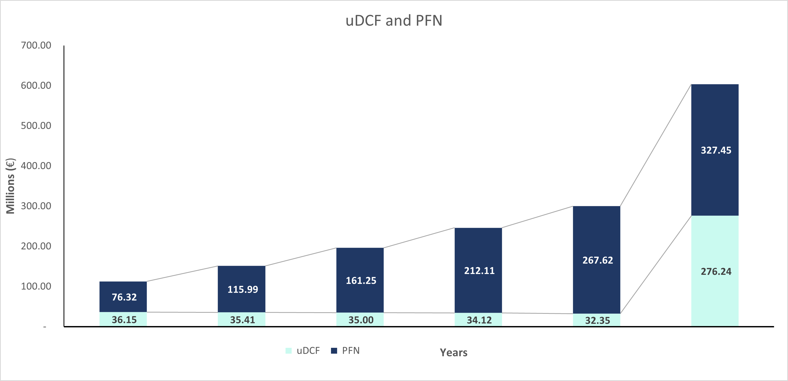

# Integrated Financial Model & Intrinsic Valuation: TechNova Solutions S.p.A.

[](https://opensource.org/licenses/MIT)
[](#)
[](#)

## Executive Summary & Investment Thesis

Questo progetto presenta un modello finanziario integrato a **3 Statements (2021-2030)** e una valutazione **Discounted Cash Flow (DCF)** per **TechNova Solutions S.p.A.**, azienda leader in Italia nei servizi software B2B e nella trasformazione digitale. 

Dall'analisi emerge un profilo finanziario ad alta generazione di cassa, ideale per operazioni di **Private Equity** o come target strategico in ottica **M&A corporativa**.

###  Key Investment Insights:
* **Profilo Software Altamente Scalabile:** L'azienda vanta un Margine Lordo consolidato al **74.0%**. La progressiva efficienza sulle spese di struttura (SG&A in calo dal 35.0% al 34.0% dei ricavi) sblocca una forte leva operativa, portando l'EBIT margin dal 32.1% (2025) al **35.7%** entro il 2030.
* **Fortezza Patrimoniale (Cash Hoarding):** Al 2025 TechNova presenta una Posizione Finanziaria Netta (PFN) positiva (Cassa Netta) pari a **€76.32M** (€96.32M di Liquidità a fronte di €20.0M di Debito Finanziario). Questa riserva annulla il rischio di insolvenza e apre scenari di allocazione del capitale aggressivi (Piani di M&A Roll-up o ricapitalizzazioni).
* **Sottovalutazione e Target Price:** Il modello DCF individua un **Enterprise Value di €413.11M** e un **Equity Value di €489.43M**. Considerando 10.0 milioni di azioni in circolazione, il valore intrinseco stimato è di **€48.94 per azione** 

---

## Financial Performance & Forecast (3-Statement Model)

Il modello prevede una crescita dei ricavi sostenibile che riflette la maturità del mercato IT, partendo da un +10.0% nel 2026 e decelerando linearmente di 1 punto percentuale all'anno fino al +6.0% nel 2030.

### Evoluzione dei Ricavi e del Margine Lordo
L'andamento storico (2021-2025) e le proiezioni (2026-2030) mostrano una crescita costante dei volumi supportata dalla stabilità della marginalità industriale.


### Sintesi delle Proiezioni Finanziarie (€ Mln)

| Voce di Bilancio | 2025 (H) | 2026 (F) | 2027 (F) | 2028 (F) | 2029 (F) | 2030 (F) |
| :--- | :---: | :---: | :---: | :---: | :---: | :---: |
| **Ricavi (Revenues)** | **160.00** | **176.00** | **191.84** | **207.19** | **221.69** | **234.99** |
| *Crescita YoY* | *+10.3%* | *+10.0%* | *+9.0%* | *+8.0%* | *+7.0%* | *+6.0%* |
| **Utile Lordo (Gross Profit)** | **118.40** | **130.24** | **141.96** | **153.32** | **164.05** | **173.89** |
| *Margine Lordo %* | *74.0%* | *74.0%* | *74.0%* | *74.0%* | *74.0%* | *74.0%* |
| **EBIT (Operating Income)** | **51.40** | **58.44** | **65.58** | **72.67** | **78.48** | **83.80** |
| *Margine EBIT %* | *32.1%* | *33.2%* | *34.2%* | *35.1%* | *35.4%* | *35.7%* |
| **Utile Netto (Net Income)** | **37.65** | **43.83** | **49.18** | **54.51** | **58.86** | **62.85** |

### Capitale Circolante Netto (NWC Drivers)
Invece di utilizzare percentuali piatte sui ricavi, il Capitale Circolante è modellato rigorosamente sulle metriche operative:
* **DSO (Days Sales Outstanding):** 36.5 giorni (Fisso)
* **DIO (Days Inventory Outstanding):** 60.5 giorni (Fisso)
* **DPO (Days Payable Outstanding):** 72.8 giorni (Fisso)

L'efficienza nel ciclo monetario permette di minimizzare l'assorbimento di cassa del circolante (con variazioni del CCN inferiori a €1.5M annui), massimizzando la conversione dell'EBIT in Free Cash Flow.

---

## DCF Valuation & Capital Structure

La valutazione aziendale è stata condotta tramite metodologia **Discounted Cash Flow (uFCFF)** ad un tasso di sconto basato sul costo medio ponderato del capitale (WACC).

### Assunzioni del Costo del Capitale (WACC)
* **Tasso Risk-Free ($R_f$):** 2.0% (Rendimento dei titoli di stato governativi di riferimento)
* **Beta di Settore ($\beta$):** 1.40 (Riflette la natura ciclica e di crescita del comparto tech)
* **Market Risk Premium ($MRP$):** 10.0% ($R_m = 12.0\%$)
* **Costo dell'Equity ($K_e$):** **16.0%** via CAPM ($2.0\% + 1.4 \times 10.0\%$)
* **Costo del Debito Net delle Tasse ($K_d$):** **4.5%** (Tasso lordo al 6.0% con Tax Rate al 25%)
* **Struttura del Capitale:** Finanziata all'87.6% da Equity (€140.92M Book Value) e al 12.4% da Debito (€20.0M).
* **WACC Risultante:** **14.57%**

$$\text{WACC} = K_e \times \frac{E}{V} + K_d \times \frac{D}{V} = 16.0\% \times 87.57\% + 4.5\% \times 12.43\% = 14.57\%$$

### Flussi di Cassa Scontati ed Enterprise Value
I flussi di cassa non vincolati (uFCFF) mantengono un tasso di conversione eccezionale, supportati da CapEx costanti a €12.0M/anno e dal piano di rimborso totale del debito (pari a €5.0M/anno, azzerato nel 2029).

* **NPV dei Flussi Espliciti (2026-2030):** €167.18 Mln
* **Terminal Value ($g = 2.0\%$):** €485.50 Mln (Attualizzato a oggi: **€245.93 Mln**)
* **Enterprise Value (EV):** **€413.11 Mln**



### Dal Valore di Impresa al Target Price

| Voce di Valutazione | Valore (€ Mln) | Note / Dettagli |
| :--- | :---: | :--- |
| **Enterprise Value (EV)** | **413.11** | Valore operativo delle attività core |
| **Posizione Finanziaria Netta (PFN)** | **-76.32** | Segno negativo indica **Cassa Netta** (Liquidità €96.32M - Debito €20M) |
| **Equity Value** | **489.43** | EV - PFN ($413.11 - (-76.32)$) |
| **Azioni in Circolazione** | **10.00** | 10 milioni di azioni ordinarie diluite |
| **Target Price (Valore per Azione)** | **€ 48.94** | Valore intrinseco per singola azione |

---

## Strategic & Managerial Recommendations

In qualità di analisti finanziari, l'eccellente generazione di cassa di TechNova pone il management e gli investitori di fronte a scelte allocative cruciali (**Capital Allocation Strategy**):

1. **Strategia di M&A Roll-Up (Raccomandata):** Il settore del B2B software in Italia è altamente frammentato. TechNova non ha bisogno di raccogliere ulteriore capitale per fare acquisizioni: la sola cassa netta (€76.32M) combinata con i circa €35-45M di Free Cash Flow generati annualmente permette di finanziare una strategia di acquisizione di competitor più piccoli a multipli inferiori, accelerando la crescita dei ricavi (oltre il 6-10% organico stimato).
2. **Ottimizzazione della Struttura del Capitale:** Con un costo dell'equity ($K_e$) al 16.0% e un costo del debito ($K_d$) dopo le tasse al 4.5%, l'azienda è sovra-capitalizzata internamente. Introdurre una moderata leva finanziaria (es. mantenere un livello di Debito/EBITDA a 1.5x) ridurrebbe drasticamente il WACC sotto il 12%, aumentando immediatamente l'Enterprise Value complessivo.
3. **Politica di Distribuzione:** Qualora non vi fossero target di acquisizione strategici in grado di superare l'Hurdle Rate (WACC) del 14.57%, la cassa accumulata dovrebbe essere restituita agli azionisti tramite un programma straordinario di Buyback (riacquisto di azioni proprie) o dividendi straordinari per massimizzare il ROE.

---

##  Repository Structure

```text
├── TechNova Solutions S.p.A..xlsx   # Modello Finanziario Integrato Master (3 Statements + DCF)
├── Raw_data.csv                     # Dati storici estratti dai bilanci 2021-2025
├── 3_Statements_Model.csv           # Output del modello previsionale integrato (CE, SP, RF)
├── DCF_Model.csv                    # Calcoli di attualizzazione, WACC e sintesi dell'Equity Value
├── Assumptions_Notes.txt            # Documentazione dettagliata dei driver e delle formule usate
└── images/                          # Grafici e visualizzazioni inseriti nel report
